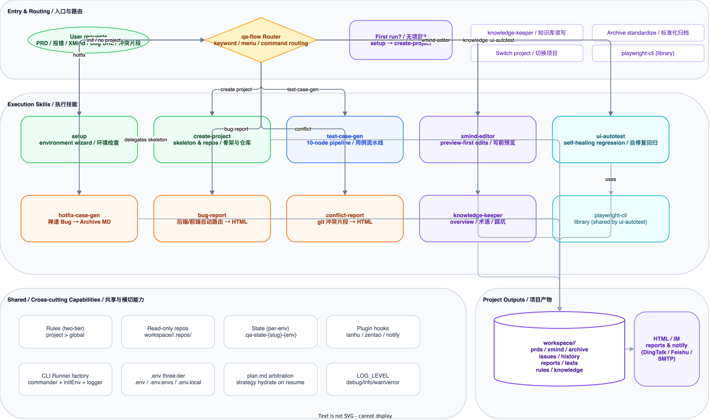
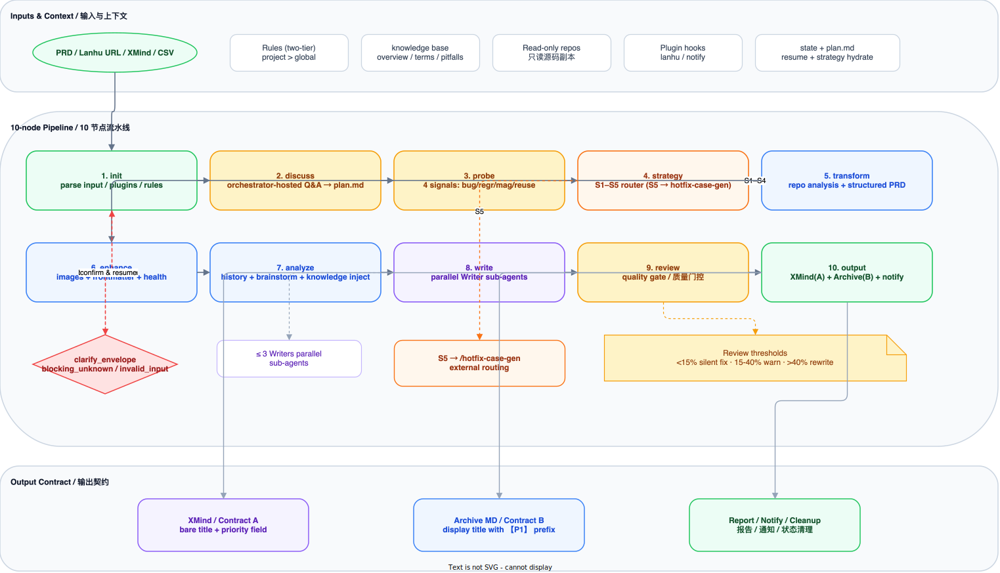
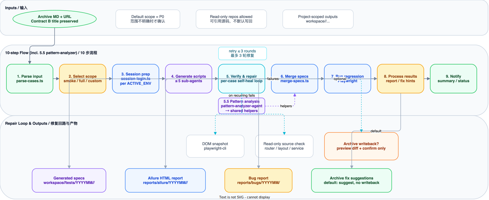
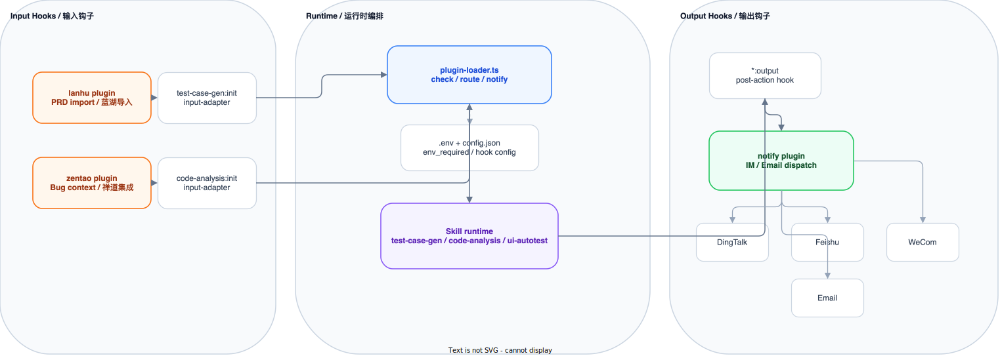

<div align="center">

# Kata - 3.0

### AI-Powered QA Workflow Engine

<br />

An intelligent QA workflow engine built on **Claude Code Skills**
From requirements to test cases, from bug analysis to UI automation — all-in-one QA coverage

<br />

[](https://nodejs.org/)
[](https://claude.com/claude-code)
[](https://playwright.dev/)
[](./LICENSE)
[](./engine/package.json)

<br />

**English** | **[Chinese](./README.md)**

<br />

```
PRD / Lanhu / historical cases ── /test-case-gen ─────> XMind (A) + Archive MD (B)
Archive MD + URL ──────────────── /ui-autotest ────────> Self-healing regression → Reports / Notifications
Existing XMind ────────────────── /case-format ────────> Preview → Confirm → Write
Zentao bug URL ────────────────── /daily-task hotfix ──> Hotfix Archive MD
Backend/frontend error logs ───── /daily-task bug ──────> HTML bug report
Git conflict snippet ──────────── /daily-task conflict ─> HTML merge-conflict report
```

</div>

<br />

---

## Table of Contents

- [Features](#features)
- [Architecture Overview](#architecture-overview)
- [Quick Start](#quick-start)
- [Workflow Details](#workflow-details)
  - [Test Case Generation](#1-test-case-generation-test-case-gen)
  - [Hotfix / Bug / Conflict Analysis](#2-hotfix--bug--conflict-analysis)
  - [XMind / Format Conversion](#3-xmind--format-conversion-case-format)
  - [UI Automation](#4-ui-automation-ui-autotest)
- [Plugin System](#plugin-system)
- [Project Structure](#project-structure)
- [Script CLI Reference](#script-cli-reference)
- [Configuration](#configuration)
- [Contributing](#contributing)
- [License](#license)

---

## Features

| Feature                         | Description                                                                                                                                                                                                                                      |
| ------------------------------- | ------------------------------------------------------------------------------------------------------------------------------------------------------------------------------------------------------------------------------------------------ |
| **7 Skills / 5 Core Workflows** | `using-kata` + `playwright-cli` + 5 primary execution workflows covering menus/init, generation, analysis, format conversion, diagnostics, and regression                                                                                        |
| **16-Agent Architecture**       | Specialized agents declare model/tools in frontmatter and are dispatched by Skills based on task complexity; includes `pattern-analyzer-agent` / `script-fixer-agent` / `convergence-agent` / `regression-runner-agent` / `source-scanner-agent` |
| **Project-Scoped Workspace**    | All artifacts are written into `workspace/&lt;project&gt;/...`, keeping projects isolated                                                                                                                                                        |
| **A/B Artifact Contract**       | XMind / intermediate artifacts use Contract A; Archive MD / display titles use Contract B                                                                                                                                                        |
| **Preview-before-Write**        | XMind `patch` / `add` / `delete` always run `--dry-run` first, then require confirmation                                                                                                                                                         |
| **Self-healing UI Regression**  | UI automation verifies each script individually, repairs up to 3 rounds, and can emit bug reports or fix hints                                                                                                                                   |
| **Plugin Hooks**                | Lanhu import, Zentao integration, and IM notifications are attached via lifecycle hooks                                                                                                                                                          |
| **Safety Gates**                | Read-only source repos, explicit side-effect confirmation, and separate reference vs writeback gates                                                                                                                                             |

---

## Architecture Overview



<details>
<summary><b>Architecture Description</b></summary>

kata uses a **Router + Skill + Agent + Plugin Hook** architecture:

- **kata Router** — Entry routing layer; first-run and project management requests are handled by the `using-kata` skill
- **7 Skills** — `using-kata` / `playwright-cli` / `test-case-gen` / `ui-autotest` / `case-format` / `daily-task` / `knowledge-keeper`
- **5 primary user workflows** — `test-case-gen`, `ui-autotest`, `case-format`, `daily-task` (bug/conflict/hotfix), `knowledge-keeper` (`using-kata` + `playwright-cli` are entry and bootstrap workflows)
- **16 standalone agents** — Each agent declares its model/tools in frontmatter and is orchestrated by a Skill; includes Phase 3's `pattern-analyzer-agent` / `script-fixer-agent` / `convergence-agent` / `regression-runner-agent` / `source-scanner-agent`
- **Cross-cutting capabilities** — CLI Runner factory, three-tier `.env`, multi-environment `kata-state` isolation, `plan.md` arbitration, `LOG_LEVEL` logging, project-level rules, read-only source repos, plugin hooks
- **Project-scoped output** — artifacts are written to `workspace/<project>/`, including XMind, Archive MD, HTML reports, and Playwright + Allure assets

</details>

### Directory Structure

```
kata/
├── .claude/          ← skills / agents / settings
├── engine/           ← Core engine (bin + src + lib + hooks)
├── plugins/          ← Third-party integrations (lanhu / zentao / notify)
├── tools/            ← Standalone toolkits (dtstack-sdk)
├── lib/playwright/   ← Playwright shared library
├── templates/        ← Output templates
├── docs/             ← Documentation (architecture / audit / specs)
├── workspace/        ← User artifacts (project-scoped)
│   └── {project}/
│       ├── features/{ym}-{slug}/  ← PRD-derived artifacts
│       ├── knowledge/             ← Project-level knowledge
│       └── shared/                ← Cross-feature reuse
└── config.json       ← Project configuration
```

> Full directory reference: [docs/architecture/directory-structure.md](docs/architecture/directory-structure.md)

---

## Quick Start

### Prerequisites

- **Node.js** >= 22
- **Claude Code CLI** — [Installation Guide](https://claude.com/claude-code)

### Installation

Recommended: hand the installation off to a Coding Agent (Claude Code / Cursor / Codex, etc.). After cloning the repo, **copy-paste** this prompt into your agent:

```text
Please read INSTALL.md in the repository root and follow its Execution Plan
step by step to install and verify kata. Stop immediately on any failure
and report the error to me — do not silently downgrade or skip steps.
```

Manual install:

```bash
git clone https://github.com/your-org/kata.git
cd kata
bun install
cp .env.example .env
cp .env.envs.example .env.envs
kata-cli config            # config sanity check
bun test --cwd engine                         # must be all green
bunx playwright install                       # only needed for UI automation
```

### Initialize

Follow the `INSTALL.md` guide in the repository root to complete environment setup, or in Claude Code start with:

```
/using-kata
```

A 6-step interactive wizard will guide you through:

| Step | Description                                                                               |
| ---- | ----------------------------------------------------------------------------------------- |
| 1    | Environment detection — Node.js, Bun, config files, and core scripts                      |
| 2    | Project management — Select an existing project or create a new one                       |
| 3    | Workspace setup — Create the standard `workspace/<project>/` structure                    |
| 4    | Source repo configuration — Clone Git repos into `workspace/<project>/.repos/` (optional) |
| 5    | Plugin configuration — Check for plugin credentials in `.env` (optional)                  |
| 6    | Environment verification — Comprehensive validation of all config items                   |

### Quick Commands

The current user-facing trigger phrases are Chinese-first; the examples below are the actual commands used in Claude Code.

```bash
# Show feature menu
/using-kata

# Generate test cases from PRD
为 {{requirement_name}} 生成测试用例

# Quick mode (skip interactions, 1-round review)
为 {{requirement_name}} --quick 生成测试用例

# Import from Lanhu URL
生成测试用例 https://lanhuapp.com/web/#/item/project/product?tid={{tid}}&docId={{docId}}

# Analyze error logs
帮我分析这个报错

# Edit existing XMind cases
修改用例 "Verify export only exports filtered results"

# Standardize legacy XMind / CSV into Archive MD
标准化归档 workspace/<project>/history/legacy-cases.xmind

# UI automation test
UI自动化测试 {{requirement_name}} https://your-app.example.com

# Switch active project
切换项目
```

---

## Workflow Details

### 1. Test Case Generation (`/test-case-gen`)

Transforms PRD / Story documents into structured XMind and Archive Markdown test cases.

#### Pipeline



#### 10 Nodes

| Node | Name          | Description                                                                        | Key Scripts                                           |
| ---- | ------------- | ---------------------------------------------------------------------------------- | ----------------------------------------------------- |
| 1    | **init**      | Parse input, restore state, and load project/plugin context                        | `kata-state.ts`, `plugin-loader.ts`, `rule-loader.ts` |
| 2    | **discuss**   | Orchestrator-hosted requirements discussion; persists `plan.md`                    | `discuss.ts`, `plan.ts`                               |
| 3    | **probe**     | 4-dimension signal probe (bug / regression / feature-magnitude / reuse-score)      | `case-signal-analyzer.ts`                             |
| 4    | **strategy**  | 5-strategy dispatch (S1–S5; S5 routes to `hotfix-case-gen`)                        | `case-strategy-resolver.ts`                           |
| 5    | **transform** | Source code analysis + PRD structuring, with structured `clarify_envelope`         | `repo-profile.ts`, `repo-sync.ts`                     |
| 6    | **enhance**   | Image recognition, frontmatter normalization, and health pre-check                 | `image-compress.ts`, `prd-frontmatter.ts`             |
| 7    | **analyze**   | Historical case retrieval + QA brainstorming → test point checklist (w/ knowledge) | `archive-gen.ts search`, `writer-context-builder.ts`  |
| 8    | **write**     | Parallel Writer Sub-Agents generate Contract A cases by module                     | Parallel sub-agents                                   |
| 9    | **review**    | Quality-gate review (threshold < 15% / 15–40% / > 40%), up to 2 rounds             | Quality gate                                          |
| 10   | **output**    | Generate XMind (A) + Archive MD (B), send notifications, and clean state           | `xmind-gen.ts`, `archive-gen.ts`                      |

#### Quality Gate (Review Node)

| Threshold    | Action                            |
| ------------ | --------------------------------- |
| < 15% issues | Silent fix — Fix directly         |
| 15% - 40%    | Auto-fix + Warning — Fix and warn |
| > 40%        | Block — Reject and rewrite        |

#### Run Modes

```bash
# Normal mode (full pipeline with interactions)
为 {{requirement_name}} 生成测试用例

# Quick mode (skip interactions, 1-round review)
为 {{requirement_name}} --quick 生成测试用例

# Resume from breakpoint
继续 {{requirement_name}} 的用例生成

# Re-run specific module
重新生成 {{requirement_name}} 的「List Page」模块用例
```

#### Sub-Flows

<details>
<summary><b>Standardize Archive Flow</b> (XMind/CSV input)</summary>

Standardize existing XMind or CSV files into normalized Archive MD format:

```
S1: Parse source file → S2: AI standardize rewrite → S3: Quality review → S4: Output
```

</details>

<details>
<summary><b>Reverse Sync Flow</b> (XMind → Archive MD)</summary>

Reverse-sync XMind test cases into Archive Markdown with preview / confirm / write controls:

```
RS1: Confirm XMind → RS2: Parse → RS3: Locate Archive MD → RS4: Preview or Write → RS5: Report
```

</details>

---

### 2. Hotfix / Bug / Conflict Analysis

The former `code-analysis` umbrella has been split along business boundaries into three focused skills with precise pre-guards and independent trigger words. The underlying agents are unchanged:

| Skill                      | Input signal                                              | Dispatched agent                                                | Output                                                  |
| -------------------------- | --------------------------------------------------------- | --------------------------------------------------------------- | ------------------------------------------------------- |
| **`/daily-task hotfix`**   | Zentao Bug URL (containing `bug-view-`) or raw Bug ID     | `hotfix-case-agent`                                             | `workspace/<project>/issues/YYYYMM/hotfix_*.md`         |
| **`/daily-task bug`**      | Java stack traces / HTTP errors / frontend console errors | `backend-bug-agent` (backend) / `frontend-bug-agent` (frontend) | `workspace/<project>/reports/bugs/YYYYMMDD/*.html`      |
| **`/daily-task conflict`** | Snippet containing `<<<<<<< HEAD` / `=======` / `>>>>>>>` | `conflict-agent`                                                | `workspace/<project>/reports/conflicts/YYYYMMDD/*.html` |

#### Two-Gate Policy

`bug-report` / `hotfix-case-gen` follow a **two-gate** policy when source code access is required:

- **Gate 1** — Confirm repo / branch / path before source reference or repo sync
- **Gate 2** — If `.env` or branch mapping should be written back, preview it and confirm separately

`conflict-report` operates directly on the pasted conflict snippet — no source sync required.

#### Usage

```bash
# Paste a Zentao Bug URL to auto-trigger Hotfix case generation
{{ZENTAO_BASE_URL}}/zentao/bug-view-{{bug_id}}.html

# Paste a stack trace — auto-routes to backend or frontend analysis
帮我分析这个报错
<Exception in thread "main" java.lang.NullPointerException ... / TypeError: Cannot read ...>

# Paste a git conflict snippet
分析冲突
<<<<<<< HEAD
...
=======
...
>>>>>>>
```

---

### 3. XMind / Format Conversion (`/case-format`)

Perform local edits on existing XMind files without re-reading PRDs. All write operations now follow **preview-first**: `--dry-run` preview, user confirmation, then real write. Preference learning runs after the write is confirmed.

#### Operations

| Operation | Command                                    | Preview / execution flow                                                            |
| --------- | ------------------------------------------ | ----------------------------------------------------------------------------------- |
| Search    | `搜索用例 "export"`                        | `xmind-patch.ts search "keyword"`                                                   |
| Show      | `查看用例 "Verify list page default load"` | `xmind-patch.ts show --file X --title "Y"`                                          |
| Modify    | `修改用例 "Verify export filters"`         | `xmind-patch.ts patch --file X --title "Y" --case-json '{...}' --dry-run` → confirm |
| Add       | `新增用例 到 "Rule List Page" 分组`        | `xmind-patch.ts add --file X --parent "Y" --case-json '{...}' --dry-run` → confirm  |
| Delete    | `删除用例 "Verify xxx"`                    | `xmind-patch.ts delete --file X --title "Y" --dry-run` → confirm                    |

#### Preference Learning

After modifications, the AI automatically extracts reusable writing rules and persists them to `rules/case-writing.md`, influencing future test-case-gen output style.

---

### 4. UI Automation (`/ui-autotest`)

Transforms Archive MD test cases into Playwright TypeScript scripts, executes by priority in parallel, and auto-generates bug reports on failure.

#### Pipeline



#### 9 Steps

| Step | Name                   | Description                                                                     |
| ---- | ---------------------- | ------------------------------------------------------------------------------- |
| 1    | **Parse Input**        | Extract `md_path` and `url`, parse Archive MD via `parse-cases.ts`              |
| 2    | **Select Scope**       | Only prompt when scope is unclear: smoke / full / custom                        |
| 3    | **Session Prep**       | Check/create login session via `session-login.ts` (isolated per `ACTIVE_ENV`)   |
| 4    | **Script Generation**  | Up to 5 parallel Sub-Agents generate `.ts` code blocks                          |
| 5    | **Per-case Verify**    | Each script is executed individually and self-healed for up to 3 rounds         |
| 5.5  | **Pattern Analysis**   | `pattern-analyzer-agent` extracts shared helpers from recurring failures        |
| 6    | **Merge Specs**        | `merge-specs.ts` assembles `smoke.spec.ts` and `full.spec.ts`                   |
| 7    | **Run Regression**     | `bunx playwright test` executes the merged smoke / full specs                   |
| 8    | **Process Results**    | Generate **Allure reports**, bug reports, and Archive MD correction suggestions |
| 9    | **Send Notifications** | Plugin sends pass/fail summary via IM                                           |

#### Test Scope

| Mode   | Cases         | Command                                     |
| ------ | ------------- | ------------------------------------------- |
| Smoke  | P0 only       | `UI自动化测试 {{requirement_name}} {{url}}` |
| Full   | P0 + P1 + P2  | `执行UI测试 {{archive_md_path}} {{url}}`    |
| Custom | User-selected | Interactive selection after parsing         |

#### Output

| Type                | Path                                                      |
| ------------------- | --------------------------------------------------------- |
| Temporary UI blocks | `workspace/<project>/.temp/ui-blocks/`                    |
| E2E specs           | `workspace/<project>/tests/YYYYMM/<suite_name>/`          |
| Allure reports      | `workspace/<project>/reports/allure/YYYYMM/<suite_name>/` |
| Bug reports         | `workspace/<project>/reports/bugs/YYYYMM/`                |

---

## Plugin System



### Built-in Plugins

| Plugin     | Hook                   | Function                                            | Activation                                          |
| ---------- | ---------------------- | --------------------------------------------------- | --------------------------------------------------- |
| **lanhu**  | `test-case-gen:init`   | Crawl PRD documents and screenshots from Lanhu URLs | Configure `LANHU_COOKIE` in `.env`                  |
| **zentao** | `hotfix-case-gen:init` | Read Zentao bug details and related information     | Configure `ZENTAO_BASE_URL` + credentials in `.env` |
| **notify** | `*:output`             | DingTalk / Feishu / WeCom / Email notifications     | Configure any channel's Webhook or SMTP in `.env`   |

### Lifecycle Hooks

| Hook           | Phase                  | Type                                           |
| -------------- | ---------------------- | ---------------------------------------------- |
| `<skill>:init` | Skill initialization   | `input-adapter` — Adapt input format           |
| `*:output`     | After any Skill output | `post-action` — Notifications, archiving, etc. |

### Developing Custom Plugins

Create a `plugin.json` under `plugins/<plugin-name>/`:

```json
{
  "name": "my-plugin",
  "description": "Plugin description",
  "version": "1.0.0",
  "env_required": ["MY_PLUGIN_API_KEY"],
  "hooks": {
    "test-case-gen:init": "input-adapter"
  },
  "commands": {
    "fetch": "bun run plugins/my-plugin/fetch.ts --url {{url}} --output {{output_dir}}"
  },
  "url_patterns": ["example.com"]
}
```

---

## Cross-cutting Infrastructure

Phase 5 consolidated CLI / config / state / logging into four shared channels. New scripts inherit these capabilities automatically — no boilerplate duplication.

### CLI Runner Factory

`engine/lib/cli-runner.ts` exposes `createCli({ name, description, commands })`. 27 of the 28 CLI scripts use the factory, getting for free:

- Three-tier `.env` preload via `initEnv()`
- `createLogger(name)` injection
- Standard error-exit protocol (stderr + `exitCode 1`)
- `LOG_LEVEL` environment variable awareness

### Three-tier `.env`

| File         | Role                                                                      | Git status                          |
| ------------ | ------------------------------------------------------------------------- | ----------------------------------- |
| `.env`       | Core config + plugin credentials (DingTalk / Lanhu / Zentao / SMTP, etc.) | gitignore (has `.env.example`)      |
| `.env.envs`  | Multi-environment segments (`ACTIVE_ENV` / `LTQCDEV_*` / `CI63_*` / …)    | gitignore (has `.env.envs.example`) |
| `.env.local` | User-local overrides (temporary tokens / cookies)                         | gitignore (no template)             |

Merge order (later wins): `process.env > .env.local > .env.envs > .env`.

### Multi-environment State Isolation

`kata-state` filename carries an `ACTIVE_ENV` suffix: `workspace/<project>/.temp/.kata-state-<slug>-<env>.json`.

- Multiple Claude Code instances can run different environments concurrently without interference
- `resume` treats `plan.md` frontmatter as the authoritative source for `strategy_resolution` hydration
- Legacy un-suffixed files are migrated automatically on first `resume`

### LOG_LEVEL

Set `LOG_LEVEL=debug` / `info` / `warn` / `error` to control verbosity at runtime. `cli-runner` calls `initLogLevel()` automatically.

---

## Project Structure

```text
kata/
├── .claude/
│   ├── agents/                   # 16 standalone agent definitions
├── engine/
│   ├── src/                      # Core TypeScript CLI scripts
│   │   ├── state.ts              # Breakpoint/resume state management
│   │   ├── xmind-gen.ts          # XMind file generation
│   │   ├── xmind-patch.ts        # XMind CRUD operations
│   │   ├── archive-gen.ts        # Archive MD generation + search
│   │   ├── plugin-loader.ts      # Plugin detection & dispatch
│   │   ├── repo-sync.ts          # Source repo sync
│   │   ├── repo-profile.ts       # Repo profile matching
│   │   ├── image-compress.ts     # Image compression (>2000px auto-resize)
│   │   ├── prd-frontmatter.ts    # PRD frontmatter normalization
│   │   ├── config.ts             # Environment config reader
│   │   ├── lib/                  # Shared helpers and types
│   └── tests/                    # Unit tests
│   └── skills/
│       ├── using-kata/           # Feature menu + project management entry
│       ├── playwright-cli/       # Playwright CLI integration
│       ├── test-case-gen/        # Test case generation orchestrator
│       │   └── references/       # Format specs & protocols
│       ├── case-format/          # XMind editing / format conversion / bidirectional sync
│       ├── daily-task/           # Bug / conflict / hotfix three-mode skill
│       ├── knowledge-keeper/     # Business knowledge base read/write
│       ├── ui-autotest/          # Playwright UI automation orchestrator
│       │   └── scripts/          # parse-cases / merge-specs / session-login
│       └── playwright-cli/       # Playwright CLI integration
├── plugins/
│   ├── lanhu/                    # Lanhu PRD import plugin
│   ├── zentao/                   # Zentao Bug integration plugin
│   └── notify/                   # IM notification plugin
├── workspace/                    # Multi-project runtime workspace
│   ├── dataAssets/
│   │   ├── features/{ym}-{slug}/ # Aggregated feature dir (PRD/archive/xmind/tests)
│   │   ├── issues/               # Hotfix test cases
│   │   ├── history/              # Legacy CSV / XMind inputs
│   │   ├── reports/              # Bug / conflict / Allure reports
│   │   ├── knowledge/           # Project-level business knowledge base
│   │   ├── shared/              # Shared project utilities
│   │   ├── rules/               # Project-level rule overrides
│   │   ├── knowledge/           # Project-level business knowledge base
│   │   ├── .repos/               # Cloned source repos (read-only)
│   │   └── .temp/                # Temporary state and UI blocks
│   └── xyzh/
│       └── ...                   # Same project structure as above
├── rules/                       # Writing rule library (project > global)
│   ├── case-writing.md           # Test case writing conventions
│   ├── data-preparation.md       # Test data preparation rules
│   ├── prd-recognition.md        # PRD recognition patterns
│   └── xmind-structure.md        # XMind structure rules
├── templates/                    # Handlebars report templates
├── tests/                        # E2E test specs
│   └── e2e/YYYYMM/              # Playwright test files
├── assets/
│   └── diagrams/                 # Architecture & workflow diagrams
├── config.json                   # Repo profile mappings
├── .env.example                  # Environment variable template
├── biome.json                    # Code style config
├── playwright.config.ts          # Playwright configuration
└── package.json
```

---

## Script CLI Reference

All scripts are located at `engine/src/`. They share a unified entry factory (`lib/cli-runner.ts`) and are executed with `bun run`:

| Script                      | Commands                                       | Description                                          |
| --------------------------- | ---------------------------------------------- | ---------------------------------------------------- |
| `kata-state.ts`             | `init` / `resume` / `update` / `clean`         | Breakpoint state (isolated per `ACTIVE_ENV`)         |
| `plan.ts`                   | `read` / `write-strategy` / `hydrate`          | `plan.md` frontmatter read/write and arbitration     |
| `discuss.ts`                | `start` / `close`                              | Orchestrator-hosted requirements discussion session  |
| `case-signal-analyzer.ts`   | `run` / `cache-read`                           | 4-dimension signal probe                             |
| `case-strategy-resolver.ts` | `resolve`                                      | 5-strategy dispatch (S1–S5)                          |
| `writer-context-builder.ts` | `--module <name>`                              | Writer context assembly with knowledge injection     |
| `xmind-gen.ts`              | `--input <json> --output <dir>`                | Generate XMind files from JSON intermediate format   |
| `xmind-patch.ts`            | `search` / `show` / `patch` / `add` / `delete` | XMind test case CRUD                                 |
| `archive-gen.ts`            | `--input <json> --output <dir>` / `search`     | Generate Archive MD or keyword search                |
| `knowledge-keeper.ts`       | `index` / `read` / `write`                     | Business knowledge base index, read, and write       |
| `rule-loader.ts`            | `load --project <name>`                        | Two-tier rule loader (global + project)              |
| `create-project.ts`         | `scan` / `create` / `clone-repo`               | Project skeleton creation/repair, source repo clone  |
| `image-compress.ts`         | `--dir <dir>`                                  | Batch image compression (>2000px auto-resize)        |
| `plugin-loader.ts`          | `check` / `notify`                             | Plugin availability check and notification dispatch  |
| `repo-sync.ts`              | `--url <url> --branch <branch>`                | Source repo branch sync/clone                        |
| `repo-profile.ts`           | `match` / `save` / `sync-profile`              | Smart matching between requirements and source repos |
| `prd-frontmatter.ts`        | `--file <path>`                                | PRD frontmatter normalization                        |
| `config.ts`                 | (no args)                                      | Read `.env` and output project configuration         |

---

## Configuration

Copy `.env.example` to `.env`; for multi-environment setups also copy `.env.envs.example` to `.env.envs`.

### Core Settings

| Variable        | Required | Description                                       |
| --------------- | -------- | ------------------------------------------------- |
| `WORKSPACE_DIR` | No       | Workspace directory name, defaults to `workspace` |
| `SOURCE_REPOS`  | No       | Source repo Git URLs (comma-separated)            |

### Multi-environment (`ACTIVE_ENV`)

`.env.envs` holds credentials for multiple environments. Switch via `ACTIVE_ENV`:

| Variable         | Required | Description                                                 |
| ---------------- | -------- | ----------------------------------------------------------- |
| `ACTIVE_ENV`     | Yes      | Active environment slug (e.g., `ltqcdev` / `ci63` / `ci78`) |
| `{ENV}_BASE_URL` | Yes      | Web entrypoint for that environment (e.g., `CI63_BASE_URL`) |
| `{ENV}_USERNAME` | No       | Account for that environment                                |
| `{ENV}_PASSWORD` | No       | Password for that environment                               |
| `{ENV}_COOKIE`   | No       | Session cookie (reused by UI automation)                    |

Switch environments by editing `.env.envs` directly, or inject via shell:

```bash
ACTIVE_ENV=ci63 kata-cli kata-state resume --project dataAssets --prd-slug myPrd
```

`kata-state` filenames include the `-{env}` suffix so parallel instances never collide.

### Plugin: Lanhu

| Variable       | Required | Description        |
| -------------- | -------- | ------------------ |
| `LANHU_COOKIE` | No       | Lanhu login Cookie |

### Plugin: Zentao

| Variable          | Required | Description                                                 |
| ----------------- | -------- | ----------------------------------------------------------- |
| `ZENTAO_BASE_URL` | No       | Zentao system URL (e.g., `http://zenpms.example.cn/zentao`) |
| `ZENTAO_ACCOUNT`  | No       | Zentao account                                              |
| `ZENTAO_PASSWORD` | No       | Zentao password                                             |

### Plugin: Notify (choose any channel)

| Variable               | Required | Description                                   |
| ---------------------- | -------- | --------------------------------------------- |
| `DINGTALK_WEBHOOK_URL` | No       | DingTalk bot Webhook                          |
| `DINGTALK_KEYWORD`     | No       | DingTalk security keyword, defaults to `kata` |
| `FEISHU_WEBHOOK_URL`   | No       | Feishu bot Webhook                            |
| `WECOM_WEBHOOK_URL`    | No       | WeCom bot Webhook                             |
| `SMTP_HOST`            | No       | Email server host                             |
| `SMTP_PORT`            | No       | Email server port, defaults to `587`          |
| `SMTP_USER`            | No       | Email account                                 |
| `SMTP_PASS`            | No       | Email password / authorization code           |
| `SMTP_FROM`            | No       | Sender address                                |
| `SMTP_TO`              | No       | Recipient addresses (comma-separated)         |

---

## Contributing

Issues and Pull Requests are welcome.

### Development Workflow

```bash
# 1. Fork and create feature branch
git checkout -b feat/my-feature

# 2. Code (immutable data, functions < 50 lines, files < 800 lines)

# 3. Lint (Biome)
bun run check

# 4. Auto-fix style issues
bun run check:fix

# 5. Run core script tests
bun run test

# 6. Submit PR
```

### Commit Convention

```
<type>: <description>

Types: feat / fix / refactor / docs / test / chore / perf / ci
```

### Testing

```bash
# Run core script unit tests
bun run test

# Watch mode
bun run test:watch

# Run plugin tests as needed
bun test ./plugins/zentao/__tests__/fetch.test.ts
```

Core script tests live in `engine/tests/`; plugin tests live in `plugins/*/__tests__/`, with an 80%+ coverage target.

---

## License

[MIT](./LICENSE) &copy; 2026 kata contributors
