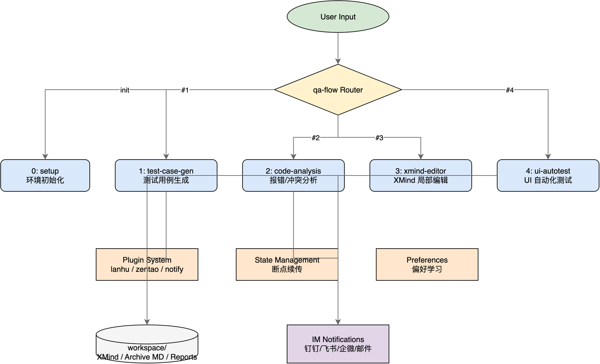
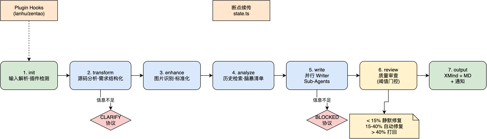
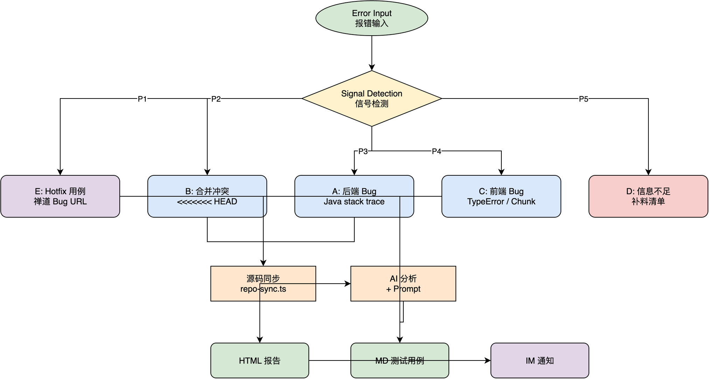
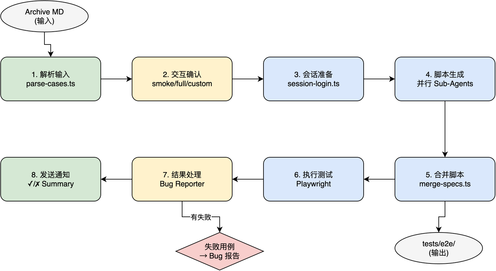

<div align="center">

# qa-flow

**AI-driven QA Test Case Generation Workflow**

> 基于 Claude Code Skills 构建的智能 QA 工作流，覆盖测试用例生成、Bug 分析、用例编辑、UI 自动化全流程。

[](https://nodejs.org/)
[](https://claude.com/claude-code)
[](https://playwright.dev/)
[](./LICENSE)

</div>

---

## Table of Contents

- [Features](#features)
- [Architecture Overview](#architecture-overview)
- [Quick Start](#quick-start)
- [Workflow Details](#workflow-details)
  - [Test Case Generation](#1-test-case-generation-test-case-gen)
  - [Code Analysis](#2-code-analysis-code-analysis)
  - [XMind Editor](#3-xmind-editor-xmind-editor)
  - [UI Automation](#4-ui-automation-ui-autotest)
- [Plugin System](#plugin-system)
- [Project Structure](#project-structure)
- [Script CLI Reference](#script-cli-reference)
- [Configuration](#configuration)
- [Contributing](#contributing)
- [License](#license)

---

## Features

| Feature                  | Description                                                    |
| ------------------------ | -------------------------------------------------------------- |
| **7-Node Pipeline**      | PRD → Transform → Enhance → Analyze → Write → Review → Output  |
| **Multi-Agent Parallel** | Writer Sub-Agents 按模块并行生成用例，大型需求效率显著提升     |
| **Plugin System**        | 蓝湖 PRD 导入、禅道 Bug 集成、IM 通知，按需启用                |
| **Interactive Flow**     | 每个关键节点提供推荐选项 + 自由输入，支持 `--quick` 和断点续传 |
| **Preference Learning**  | 用户反馈自动沉淀到 `preferences/` 目录，持续修正生成风格       |
| **Full QA Toolchain**    | 测试用例生成 + Bug 分析 + XMind 编辑 + Playwright UI 自动化    |

---

## Architecture Overview



<details>
<summary><b>Architecture Description</b></summary>

qa-flow 采用 **Skill 路由 + 插件钩子** 架构：

- **qa-flow Router** — 入口路由层，根据用户输入的关键词或编号分发到对应 Skill
- **5 个核心 Skill** — `setup` / `test-case-gen` / `code-analysis` / `xmind-editor` / `ui-autotest`
- **Plugin System** — 通过生命周期 Hook（`*:init` / `*:output`）无侵入接入
- **Cross-cutting** — 状态管理（断点续传）、偏好学习、IM 通知贯穿全流程
- **Output** — 统一输出到 `workspace/` 目录，支持 XMind / Archive MD / HTML 报告

</details>

---

## Quick Start

### Prerequisites

- **Node.js** >= 22
- **Claude Code CLI** — [Installation Guide](https://claude.com/claude-code)

### Installation

```bash
# 1. Clone the repo
git clone https://github.com/your-org/qa-flow.git
cd qa-flow

# 2. Install dependencies
npm install

# 3. Install Playwright skill (required for UI automation)
npx skills add playwright-cli

# 4. Create environment config
cp .env.example .env
```

### Initialize

在 Claude Code 中输入：

```
/setup
```

5 步交互向导自动完成：

| Step | Description                                      |
| ---- | ------------------------------------------------ |
| 1    | 环境检测 — Node.js, npm, tsx 可用性              |
| 2    | 工作区创建 — `workspace/` 子目录结构             |
| 3    | 源码仓库配置 — 克隆 Git 仓库到 `.repos/`（可选） |
| 4    | 插件配置 — 检测 `.env` 中的插件凭证（可选）      |
| 5    | 环境验证 — 综合校验所有配置项                    |

### Quick Commands

```bash
# Show feature menu
/qa-flow

# Generate test cases from PRD
为 {{需求名称}} 生成测试用例

# Quick mode (skip interactions, 1-round review)
为 {{需求名称}} --quick 生成测试用例

# Import from Lanhu URL
生成测试用例 https://lanhuapp.com/web/#/item/project/product?tid={{tid}}&docId={{docId}}

# Analyze error logs
帮我分析这个报错

# Edit existing XMind cases
修改用例 "验证导出仅导出当前筛选结果"

# UI automation test
UI自动化测试 {{需求名称}} https://your-app.example.com
```

---

## Workflow Details

### 1. Test Case Generation (`/test-case-gen`)

将 PRD / Story 文档转化为结构化 XMind 和 Archive Markdown 测试用例。

#### Pipeline



#### 7 Nodes

| Node | Name          | Description                                             | Key Scripts                               |
| ---- | ------------- | ------------------------------------------------------- | ----------------------------------------- |
| 1    | **init**      | 解析输入、检测断点、加载插件                            | `state.ts`, `plugin-loader.ts`            |
| 2    | **transform** | 源码分析 + PRD 结构化，含 CLARIFY 交互协议（最多 3 轮） | `repo-profile.ts`, `repo-sync.ts`         |
| 3    | **enhance**   | 图片识别、frontmatter 标准化、页面高亮提取              | `image-compress.ts`, `prd-frontmatter.ts` |
| 4    | **analyze**   | 历史用例检索 + QA 头脑风暴 → 测试点清单                 | `archive-gen.ts search`                   |
| 5    | **write**     | 按模块拆分并行 Writer Sub-Agents 生成用例               | Parallel sub-agents                       |
| 6    | **review**    | 质量门控审查（阈值 < 15% / 15-40% / > 40%），最多 2 轮  | Quality gate                              |
| 7    | **output**    | 生成 XMind + Archive MD，发送 IM 通知，清理状态         | `xmind-gen.ts`, `archive-gen.ts`          |

#### Quality Gate (Review Node)

| Threshold    | Action                          |
| ------------ | ------------------------------- |
| < 15% issues | Silent fix — 直接修复           |
| 15% - 40%    | Auto-fix + Warning — 修复并警告 |
| > 40%        | Block — 打回重写                |

#### Run Modes

```bash
# Normal mode (full pipeline with interactions)
为 {{需求名称}} 生成测试用例

# Quick mode (skip interactions, 1-round review)
为 {{需求名称}} --quick 生成测试用例

# Resume from breakpoint
继续 {{需求名称}} 的用例生成

# Re-run specific module
重新生成 {{需求名称}} 的「列表页」模块用例
```

#### Sub-Flows

<details>
<summary><b>Standardize Archive Flow</b> (XMind/CSV 输入)</summary>

将已有 XMind 或 CSV 文件标准化为规范的 Archive MD 格式：

```
S1: 解析源文件 → S2: AI 标准化重写 → S3: 质量审查 → S4: 输出
```

</details>

<details>
<summary><b>Reverse Sync Flow</b> (XMind → Archive MD)</summary>

将 XMind 用例逆向同步为 Archive Markdown：

```
RS1: 确认 XMind → RS2: 解析 → RS3: 定位 Archive MD → RS4: 转换 → RS5: 确认
```

</details>

---

### 2. Code Analysis (`/code-analysis`)

将报错日志、合并冲突或禅道 Bug 链接转化为结构化 HTML 报告或 Hotfix 测试用例。

#### Routing



#### 5 Modes (Priority-based)

| Priority | Mode                  | Signal                                     | Output        |
| -------- | --------------------- | ------------------------------------------ | ------------- |
| P1       | **Hotfix Case**       | 禅道 Bug URL                               | MD 测试用例   |
| P2       | **Merge Conflict**    | `<<<<<<< HEAD` markers                     | HTML 冲突报告 |
| P3       | **Backend Bug**       | Java stack trace, `Exception`, `Caused by` | HTML Bug 报告 |
| P4       | **Frontend Bug**      | `TypeError`, `ChunkLoadError`, React error | HTML Bug 报告 |
| P5       | **Insufficient Info** | 模糊描述                                   | 补料清单      |

#### Processing Pipeline

```
Signal Detection → Mode Routing → [Source Sync] → AI Analysis → Report Generation → IM Notification
```

#### Usage

```bash
# Paste error logs directly
帮我分析这个报错

# Zentao Bug URL triggers Hotfix case generation
{{ZENTAO_BASE_URL}}/zentao/bug-view-{{bug_id}}.html
```

#### Output Directories

| Type             | Path                                    |
| ---------------- | --------------------------------------- |
| Bug Reports      | `workspace/reports/bugs/YYYYMMDD/`      |
| Conflict Reports | `workspace/reports/conflicts/YYYYMMDD/` |
| Hotfix Cases     | `workspace/issues/YYYYMM/`              |

---

### 3. XMind Editor (`/xmind-editor`)

直接在已有 XMind 文件上进行局部操作，无需重新读取 PRD。修改完成后自动触发偏好学习流程。

#### Operations

| Operation | Command                                 | Script                                                         |
| --------- | --------------------------------------- | -------------------------------------------------------------- |
| Search    | `搜索用例 "导出"`                       | `xmind-edit.ts search "keyword"`                               |
| Show      | `查看用例 "验证列表页默认加载"`         | `xmind-edit.ts show --file X --title "Y"`                      |
| Modify    | `修改用例 "验证导出仅导出当前筛选结果"` | `xmind-edit.ts patch --file X --title "Y" --case-json '{...}'` |
| Add       | `新增用例 到 "规则列表页" 分组`         | `xmind-edit.ts add --file X --parent "Y" --case-json '{...}'`  |
| Delete    | `删除用例 "验证xxx"`                    | `xmind-edit.ts delete --file X --title "Y"`                    |

#### Preference Learning

修改完成后，AI 自动提取可复用的编写规则并写入 `preferences/case-writing.md`，影响后续 test-case-gen 的生成风格。

---

### 4. UI Automation (`/ui-autotest`)

将 Archive MD 测试用例转化为 Playwright TypeScript 脚本，按优先级并行执行，失败时自动生成 Bug 报告。

#### Pipeline



#### 8 Steps

| Step | Name                    | Description                                               |
| ---- | ----------------------- | --------------------------------------------------------- |
| 1    | **Parse Input**         | 提取 `md_path` 和 `url`，通过 `parse-cases.ts` 解析用例   |
| 2    | **Interactive Confirm** | 用户选择范围：smoke (P0) / full (P0+P1+P2) / custom       |
| 3    | **Session Prep**        | 通过 `session-login.ts` 检查/创建登录 session             |
| 4    | **Script Generation**   | 最多 5 个并行 Sub-Agents 生成 `.ts` 代码块                |
| 5    | **Merge Scripts**       | `merge-specs.ts` 合并为 `smoke.spec.ts` 和 `full.spec.ts` |
| 6    | **Execute Tests**       | `npx playwright test` with HTML reporter                  |
| 7    | **Process Results**     | 失败用例触发 Bug Reporter Sub-Agents 生成报告             |
| 8    | **Send Notifications**  | 通过 Plugin 发送通过/失败摘要                             |

#### Test Scope

| Mode   | Cases         | Command                                  |
| ------ | ------------- | ---------------------------------------- |
| Smoke  | P0 only       | `UI自动化测试 {{需求名称}} {{url}}`      |
| Full   | P0 + P1 + P2  | `执行UI测试 {{archive_md_path}} {{url}}` |
| Custom | User-selected | Interactive selection after parsing      |

#### Output

| Type               | Path                                     |
| ------------------ | ---------------------------------------- |
| E2E Specs          | `tests/e2e/YYYYMM/<suite_name>/`         |
| Playwright Reports | `workspace/reports/playwright/YYYYMMDD/` |

---

## Plugin System


### Built-in Plugins

| Plugin     | Hook                 | Function                       | Activation                                |
| ---------- | -------------------- | ------------------------------ | ----------------------------------------- |
| **lanhu**  | `test-case-gen:init` | 从蓝湖 URL 爬取 PRD 文档和截图 | `.env` 配置 `LANHU_COOKIE`                |
| **zentao** | `code-analysis:init` | 读取禅道 Bug 详情和关联信息    | `.env` 配置 `ZENTAO_BASE_URL` + 账号密码  |
| **notify** | `*:output`           | 钉钉 / 飞书 / 企微 / 邮件通知  | `.env` 配置任意一个通道的 Webhook 或 SMTP |

### Lifecycle Hooks

| Hook           | Phase             | Type                                 |
| -------------- | ----------------- | ------------------------------------ |
| `<skill>:init` | Skill 初始化阶段  | `input-adapter` — 适配输入格式       |
| `*:output`     | 任意 Skill 产出后 | `post-action` — 通知、归档等后置动作 |

### Developing Custom Plugins

在 `plugins/<plugin-name>/` 下创建 `plugin.json`：

```json
{
  "name": "my-plugin",
  "description": "Plugin description",
  "version": "1.0.0",
  "env_required": ["MY_PLUGIN_API_KEY"],
  "hooks": {
    "test-case-gen:init": "input-adapter"
  },
  "commands": {
    "fetch": "npx tsx plugins/my-plugin/fetch.ts --url {{url}} --output {{output_dir}}"
  },
  "url_patterns": ["example.com"]
}
```

---

## Project Structure

```text
qa-flow/
├── .claude/
│   ├── scripts/                  # Core TypeScript CLI scripts
│   │   ├── state.ts              # Breakpoint/resume state management
│   │   ├── xmind-gen.ts          # XMind file generation
│   │   ├── xmind-edit.ts         # XMind CRUD operations
│   │   ├── archive-gen.ts        # Archive MD generation + search
│   │   ├── plugin-loader.ts      # Plugin detection & dispatch
│   │   ├── repo-sync.ts          # Source repo sync
│   │   ├── repo-profile.ts       # Repo profile matching
│   │   ├── image-compress.ts     # Image compression (>2000px auto-resize)
│   │   ├── prd-frontmatter.ts    # PRD frontmatter normalization
│   │   ├── config.ts             # Environment config reader
│   │   └── __tests__/            # Unit tests (80%+ coverage)
│   └── skills/
│       ├── qa-flow/              # Entry menu router
│       ├── setup/                # 5-step initialization wizard
│       ├── test-case-gen/        # Test case generation (core pipeline)
│       │   ├── prompts/          # AI prompts per pipeline node
│       │   └── references/       # Format specs & protocols
│       ├── code-analysis/        # Bug / conflict analysis
│       │   ├── prompts/          # Mode-specific prompts
│       │   └── references/       # Env vs code guide
│       ├── xmind-editor/         # XMind case editing
│       ├── ui-autotest/          # Playwright UI automation
│       │   ├── scripts/          # parse-cases / merge-specs / session-login
│       │   └── prompts/          # Script writer & bug reporter prompts
│       └── playwright-cli/       # Playwright CLI integration
├── plugins/
│   ├── lanhu/                    # Lanhu PRD import plugin
│   ├── zentao/                   # Zentao Bug integration plugin
│   └── notify/                   # IM notification plugin
├── workspace/                    # Runtime output directory
│   ├── prds/                     # PRD / Story documents
│   ├── xmind/                    # Generated XMind files (YYYYMM/)
│   ├── archive/                  # Archive Markdown test cases (YYYYMM/)
│   ├── issues/                   # Hotfix test cases
│   ├── reports/                  # Bug / conflict / Playwright reports
│   └── .repos/                   # Cloned source repos (read-only)
├── preferences/                  # User preference rules (auto-written)
│   ├── case-writing.md           # Test case writing conventions
│   ├── data-preparation.md       # Test data preparation rules
│   ├── prd-recognition.md        # PRD recognition patterns
│   └── xmind-structure.md        # XMind structure preferences
├── templates/                    # Handlebars report templates
│   ├── archive.md.hbs
│   ├── bug-report.html.hbs
│   └── conflict-report.html.hbs
├── tests/                        # E2E test specs
│   └── e2e/YYYYMM/              # Playwright test files
├── docs/
│   └── diagrams/                 # Architecture & workflow diagrams
├── config.json                   # Repo profile mappings
├── .env.example                  # Environment variable template
├── biome.json                    # Code style config
├── playwright.config.ts          # Playwright configuration
└── package.json
```

---

## Script CLI Reference

所有脚本位于 `.claude/scripts/`，使用 `npx tsx` 执行：

| Script               | Commands                                       | Description                        |
| -------------------- | ---------------------------------------------- | ---------------------------------- |
| `state.ts`           | `init` / `resume` / `update` / `clean`         | 断点状态初始化、续传、更新与清理   |
| `xmind-gen.ts`       | `--input <json> --output <dir>`                | 从 JSON 中间格式生成 XMind 文件    |
| `xmind-edit.ts`      | `search` / `show` / `patch` / `add` / `delete` | XMind 用例增删改查                 |
| `archive-gen.ts`     | `--input <json> --output <dir>` / `search`     | 生成 Archive MD 或关键词搜索       |
| `image-compress.ts`  | `--dir <dir>`                                  | 批量压缩图片（超 2000px 自动缩放） |
| `plugin-loader.ts`   | `check` / `notify`                             | 插件可用性检测与通知调度           |
| `repo-sync.ts`       | `--url <url> --branch <branch>`                | 源码仓库分支同步/克隆              |
| `repo-profile.ts`    | `match` / `save` / `sync-profile`              | 需求与源码仓库智能匹配             |
| `prd-frontmatter.ts` | `--file <path>`                                | PRD frontmatter 标准化             |
| `config.ts`          | (no args)                                      | 读取 `.env` 输出项目配置           |

---

## Configuration

复制 `.env.example` 为 `.env` 并配置：

### Core Settings

| Variable        | Required | Description                    |
| --------------- | -------- | ------------------------------ |
| `WORKSPACE_DIR` | No       | 工作区目录名，默认 `workspace` |
| `SOURCE_REPOS`  | No       | 源码仓库 Git URL（逗号分隔）   |

### Plugin: Lanhu

| Variable       | Required | Description     |
| -------------- | -------- | --------------- |
| `LANHU_COOKIE` | No       | 蓝湖登录 Cookie |

### Plugin: Zentao

| Variable          | Required | Description                                          |
| ----------------- | -------- | ---------------------------------------------------- |
| `ZENTAO_BASE_URL` | No       | 禅道系统地址（如 `http://zenpms.example.cn/zentao`） |
| `ZENTAO_ACCOUNT`  | No       | 禅道账号                                             |
| `ZENTAO_PASSWORD` | No       | 禅道密码                                             |

### Plugin: Notify (任选一个通道)

| Variable               | Required | Description                    |
| ---------------------- | -------- | ------------------------------ |
| `DINGTALK_WEBHOOK_URL` | No       | 钉钉群机器人 Webhook           |
| `DINGTALK_KEYWORD`     | No       | 钉钉安全关键词，默认 `qa-flow` |
| `FEISHU_WEBHOOK_URL`   | No       | 飞书群机器人 Webhook           |
| `WECOM_WEBHOOK_URL`    | No       | 企业微信群机器人 Webhook       |
| `SMTP_HOST`            | No       | 邮件服务器地址                 |
| `SMTP_PORT`            | No       | 邮件端口，默认 `587`           |
| `SMTP_USER`            | No       | 邮件账号                       |
| `SMTP_PASS`            | No       | 邮件密码 / 授权码              |
| `SMTP_FROM`            | No       | 发件人地址                     |
| `SMTP_TO`              | No       | 收件人地址（逗号分隔）         |

---

## Contributing

欢迎提交 Issue 和 Pull Request。

### Development Workflow

```bash
# 1. Fork and create feature branch
git checkout -b feat/my-feature

# 2. Code (immutable data, functions < 50 lines, files < 800 lines)

# 3. Lint (Biome)
npm run check

# 4. Auto-fix style issues
npm run check:fix

# 5. Run tests
npm test

# 6. Submit PR
```

### Commit Convention

```
<type>: <description>

Types: feat / fix / refactor / docs / test / chore / perf / ci
```

### Testing

```bash
# Run all unit tests
npm test

# Watch mode
npm run test:watch
```

Test files are located at `.claude/scripts/__tests__/` with 80%+ coverage target.

---

## License

[MIT](./LICENSE) &copy; 2026 qa-flow contributors
