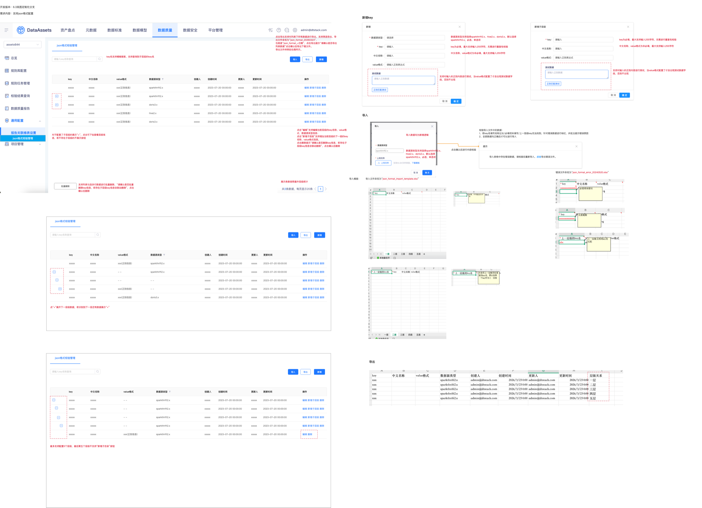

# 【通用配置】json格式配置

## 需求来源

- 蓝湖页面：`15696【通用配置】json格式配置`
- 文档版本：`数据资产V6.4.10`
- 需求关系：本需求为 15693、15694 的上游基础配置，需先于依赖需求生成用例。
- 用户补充：列表、弹窗、导入/导出与结果表现细节已通过补充截图确认。

## 需求摘要

- 需求内容：新增 `json格式校验管理` 页面，用于维护 json key、中文名称、value 格式、数据源类型及层级结构。
- 页面目标：为 json key 范围校验和值格式校验提供统一可维护的基础数据。
- 页面入口：`数据质量 → 通用配置 → json格式校验管理`。
- 页面范围：列表查询（支持模糊搜索子层级 key、条数按最外层级统计）、树形下钻、新增、编辑、新增子层级、删除、批量删除、导入、导出（支持全量导出与筛选导出）。

## 页面截图

#### 图1 页面要点

- 页面类型：通用配置管理页，包含树形列表与配置弹窗。
- 区域构成：顶部搜索与操作按钮区、中部树形列表区、行操作区、弹窗区。
- 关键操作：按 key 查询、导入、导出、新增、编辑、新增子层级、删除、展开下一层级。
- 列表信息：`key`、`中文名称`、`value格式`、`数据源类型`、`创建人`、`创建时间`、`更新人`、`更新时间`、`操作`。
- 检索条件：`key名称`，支持模糊搜索并可命中子层级 key。
- 输入项：`key`、`中文名称`、`value格式`、`数据源类型`。
- 流程/状态：存在子层级时显示 `+` 并支持逐级下钻；列表条数按最外层级统计；最多 5 层；删除与导出均存在确认提示。
- 弹窗补充：新增/新增子层级弹窗在 `value格式` 已填写时会出现 `测试数据` 输入区与正则匹配测试按钮；未填写时该区域不出现。

## 需求澄清结果

- 已确认实际入口为 `数据质量 → 通用配置 → json格式校验管理`。
- 后续 Writer 与 Reviewer 必须使用岚图定制化项目中的真实菜单路径，不得回退为标品路径。

## 页面关键模块

1. 顶部操作区：支持 `请输入key名称查询`、`导入`、`导出`、`新增`；搜索支持模糊匹配并可命中子层级 key。
2. 树形列表区：按最外层级统计展示条数；存在子层级时展示 `+`，支持逐级下钻查看。
3. 列表字段区：至少包含 `key`、`中文名称`、`value格式`、`数据源类型`、`创建人`、`创建时间`、`更新人`、`更新时间`、`操作`。
4. 行操作区：支持 `编辑`、`新增子层级`、`删除`；第五层不再展示新增子层级入口。
5. 弹窗区：支持新增/编辑当前层级信息；顶层弹窗包含 `数据源类型`，新增子层级弹窗不展示 `数据源类型`；`value格式` 已填写时出现用于验证格式的测试数据输入区和测试按钮。
6. 导入反馈区：导入校验失败时给出错误提示，并支持导出错误文件。
7. 导出反馈区：支持对列表全量数据导出，也支持按当前筛选条件导出；导出前弹出确认提示。

## 关键字段与交互规则

### 列表与树形展示

- 仅存在子层级的记录展示 `+` 展开按钮；无子层级时不展示。
- 点击 `+` 后进入下一层级数据；若下一层仍有子层级，继续展示 `+`。
- 搜索支持模糊匹配；输入子层级 key 名称时也能命中对应层级记录。
- 列表总条数按最外层级统计，展开子层级后展示条数口径不变。
- 最多支持 5 个层级；第 5 层不支持 `新增子层级`。

### 新增/编辑字段规则

- `key`：必填，最大 255 字符，**不做重复性校验**。
- `中文名称`：非必填，最大 255 字符。
- `value格式`：非必填，最大 255 字符，按页面文案表现为正则表达式输入。
- `数据源类型`：必填单选，默认 `sparkthrift2.x`，可选值为 `sparkthrift2.x`、`hive2.x`、`doris3.x`。
- 顶层新增/编辑弹窗在 `value格式` 已配置时展示 `测试数据` 输入区和测试按钮；`value格式` 为空时不展示该区域。
- 新增子层级弹窗仅包含 `key`、`中文名称`、`value格式` 字段，不展示 `数据源类型`；当 `value格式` 已配置时，同样展示 `测试数据` 输入区和测试按钮。

### 删除与批量删除

- 删除前提示：`请确认是否删除key信息，若存在子层级key信息会联动删除`。
- 单条删除与批量删除都需要二次确认，且会联动删除子层级数据。

### 导入/导出

- 导入模板文件名：`json_format_import_template.xlsx`。
- 导入前需校验文件内容；若存在错误数据，仅标红并批注错误原因，不允许部分导入。
- 典型错误：key 名称过长、必填项未填写、上一层级 key 无法找到。
- 错误文件名：`json_format_error_20240520.xlsx`。
- 导出文件名：`json_format_+日期`。
- 导出支持列表全量导出，也支持按当前筛选条件导出；点击导出先提示 `请确认是否导出列表数据`，确认后再下载文件。
- 导入为新增逻辑，不描述覆盖更新能力。

## 关键业务规则

1. 本页面维护的数据为 15693、15694 规则配置页的来源数据；后续规则页只允许引用此处维护的 key 与 value 格式。
2. 同一个 key 可配置 `中文名称`、`value格式`、`数据源类型` 及层级关系。
3. value 格式配置完成后，页面补充截图显示会出现测试数据验证区域，用于确认正则配置是否满足预期。
4. 页面需支持不同数据源类型下的 key 配置并长期维护，不依赖源码仓库。
5. 搜索支持模糊匹配与子层级 key 命中；列表统计口径按最外层级保持不变。
6. 导出同时支持全量导出与筛选导出，并带二次确认。

## 回归与测试关注点

### P0 主路径

1. 新增顶层 key 成功保存并展示在列表中。
2. 新增子层级成功，下钻后能看到正确层级关系。
3. 编辑已有 key 后，列表展示内容同步更新。
4. 导入合法模板后批量新增成功。
5. value 格式填写后可显示测试数据验证区域，并完成正则内容测试。

### P1 核心规则

1. `key` 为空、超过 255 字符、上级 key 不存在时禁止保存或导入。
2. `数据源类型` 默认值、可选值与单选行为正确。
3. 第 5 层不再提供 `新增子层级`。
4. 删除父级 key 时联动删除子层级并给出确认提示。
5. 搜索支持模糊匹配并能命中子层级 key；展开子层级后总条数按最外层级统计。
6. 导出支持全量/筛选两种范围，并在导出前弹出确认提示。

### P2 扩展与边界

1. 树形层级较深时的展开/收起表现。
2. 导入错误文件导出命名与批注内容。
3. 顶层弹窗与新增子层级弹窗在 `value格式` 为空/已配置时测试数据区域的显隐差异。
4. 大量 key 数据下列表与下钻性能、分页或滚动表现。

## PRD 健康度预检

- 结论：✅ 已通过补充截图补齐关键交互，可直接用于修订用例。
- 已补齐：子层级弹窗字段范围、测试数据区域显隐规则、模糊搜索命中子层级 key、列表条数统计口径、导出确认与筛选导出。

## 待澄清事项

- 当前无阻断澄清项。
