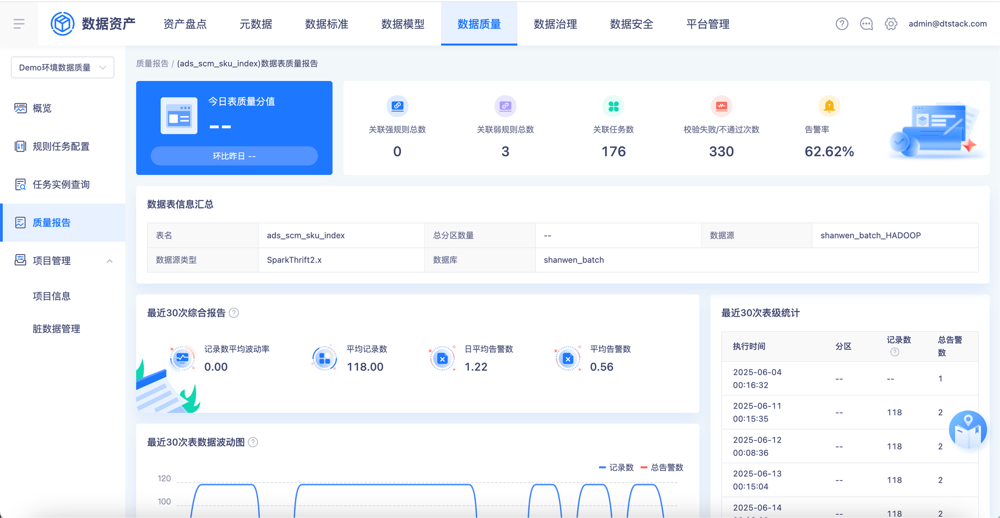
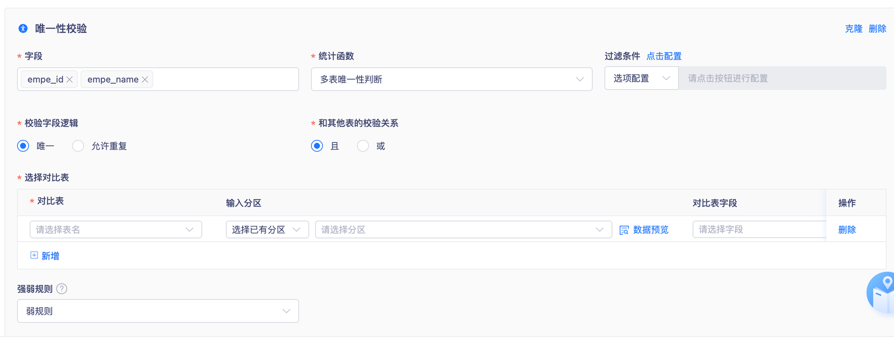
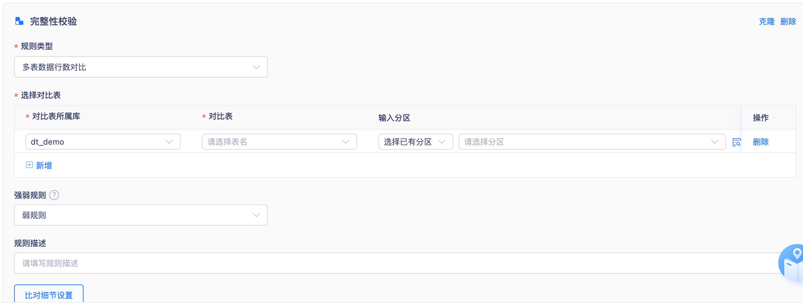
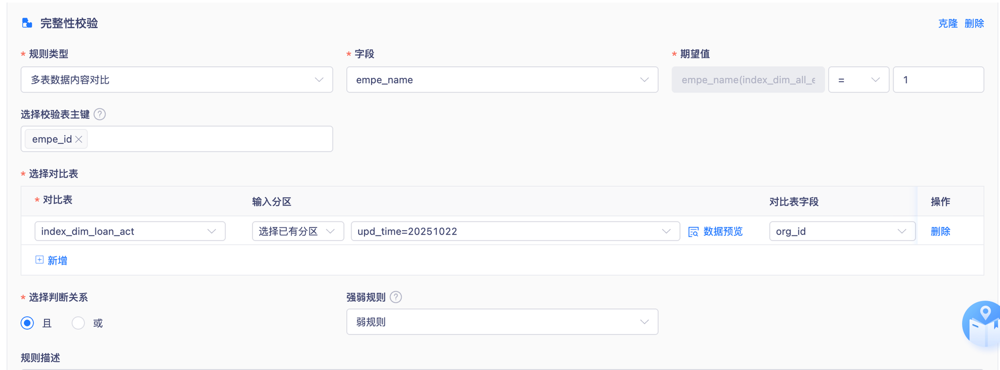
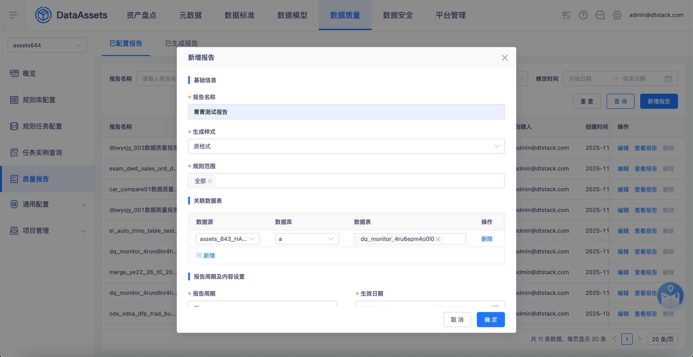
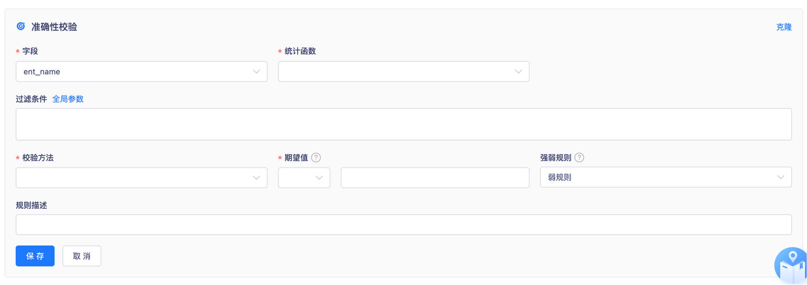
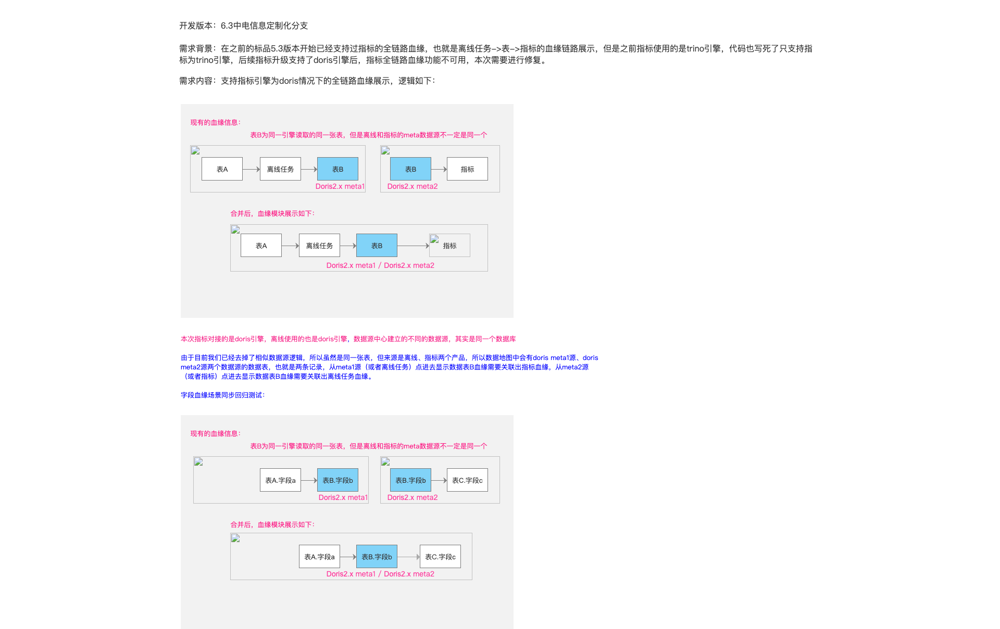
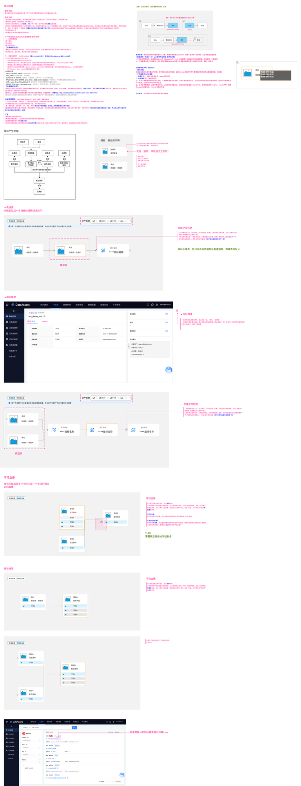

# 指标全链路血缘

## 页面元素截图

## 整页截图

✓ 📸 FULL MODE | Version: 8ea3f450...
📊 Total 2/2 pages

============================================================
🤖 STAGE 2 分析模式：【测试视角】
📋 提取测试场景、校验规则、异常清单
============================================================
📸 理解原则：视觉输出为主，文本为辅，样式数据为准
  • 视觉输出包含完整UI、流程图、交互细节
  • 文本提供关键信息提取但可能不完整
  • 建议：先看图理解整体，再用文本快速定位关键点
  • 每页附带 [设计样式参考]，包含精确的颜色值、字体规格、图片资源
  • 生成代码时必须使用 [设计样式参考] 中的精确值，禁止凭空编造颜色/字号
  • 页面图片资源已标注本地路径，生成代码时直接引用本地文件

============================================================
🐕 二狗工作指引（测试视角）
============================================================
分析完本组页面后，必须按以下格式输出：

🧠 元认知验证（测试视角）

**🔍 变更类型识别**：
- 类型：🆕新增 / 🔄修改 / ❓未明确
- 判断依据：[引用文档关键证据]
- 测试影响：🆕全量测试 / 🔄回归+增量测试

**📋 测试场景提取**：

### ✅ 正向场景（P0核心功能）
**场景1：[场景名称]**
- 前置条件：[列出]
- 操作步骤：
  1. [步骤1]
  2. [步骤2]
  ...
- 期望结果：[具体描述]
- 数据准备：[需要什么测试数据]

**场景2：[场景名称]**
...

### ⚠️ 异常场景（P1边界和异常）
**异常1：[场景名称]**
- 触发条件：[什么情况下]
- 操作步骤：[...]
- 期望结果：[错误提示/页面反应]

**异常2：[场景名称]**
...

**📋 字段校验规则表**：
| 字段名 | 必填 | 长度/格式 | 校验规则 | 错误提示文案 | 测试边界值 |
|--------|------|-----------|----------|-------------|-----------|

**🔄 状态变化表**：
| 操作 | 操作前状态 | 操作后状态 | 界面变化 |
|------|-----------|-----------|---------|

**⚠️ 特殊测试点**：
- 并发场景：[哪些操作可能并发]
- 权限验证：[哪些操作需要权限]
- 数据边界：[数据量大时的表现]

**🔗 联调测试点**（与其他模块的交互）：
- 依赖「XX模块」：[测试时需要先准备什么]
- 影响「XX模块」：[操作后需要验证哪里]

**❓ 测试疑问**（需产品/开发澄清）：
- ⚠️ [哪里不清晰，无法编写测试用例]

============================================================

📝 提醒：STAGE 4 交付物格式（完成所有分组后使用）：

【STAGE 4 输出要求 - 测试视角】

输出结构：
1. # 测试计划文档
2. ## 📊 测试概览
   - 模块数、测试场景数（正向X个，异常Y个）
   - 变更类型统计（🆕全量测试 / 🔄回归测试）
3. ## 🎯 需求性质分析（影响测试范围）
4. ## 测试用例清单（按模块）
   ### 模块X：XXX
   #### 正向场景（P0）
   - 场景1：前置条件 → 步骤 → 期望结果
   - 场景2：...
   #### 异常场景（P1）
   - 异常1：触发条件 → 期望结果
   #### 字段校验表
   | 字段 | 必填 | 规则 | 错误提示 | 边界值测试 |
5. ## 📋 测试数据准备清单
6. ## 🔄 回归测试提示（如有修改类型模块）
7. ## ❓ 测试疑问汇总（需澄清才能写用例）

质量标准：测试人员拿到后可直接写用例，知道测什么、怎么测

============================================================

📋 Return Format (due to MCP limitations):
  1️⃣ [ABOVE] All visual outputs displayed in page order (top to bottom)
  2️⃣ [BELOW] Corresponding document text content (top to bottom)

📌 Image-Text Mapping:
  • Image 1 ↔ Page 1 text: 15549【中电信息】【元数据】支持doris引擎下指标全链路血缘
  • Image 2 ↔ Page 2 text: 指标全链路血缘

💡 Please match visual outputs above with text below to understand each page's requirements
============================================================

============================================================
📝 Document Text Content (Supplementary, visual outputs above are primary)
============================================================
⚠️ Important: Text may be incomplete, for complex flowcharts/tables refer to visual outputs
💡 Text Purpose: Quick keyword search, find specific info, understand text descriptions
============================================================

────────────────────────────────────────────────────────────

15549【中电信息】【元数据】支持doris引擎下指标全链路血缘
────────────────────────────────────────────────────────────
[Flowchart/Component Text]
表A | 离线任务 | 表B | 指标 | Doris2.x meta2 | Doris2.x meta1 | Doris2.x meta1 / Doris2.x meta2 | 表B为同一引擎读取的同一张表，但是离线和指标的meta数据源不一定是同一个 | 合并后，血缘模块展示如下： | 现有的血缘信息： | 表A.字段a | 表B.字段b | 表C.字段c

[Full Page Text]
开发版本：6.3中电信息定制化分支

需求背景：在之前的标品5.3版本开始已经支持过指标的全链路血缘，也就是离线任务->表->指标的血缘链路展示，但是之前指标使用的是trino引擎，代码也写死了只支持指标为trino引擎，后续指标升级支持了doris引擎后，指标全链路血缘功能不可用，本次需要进行修复。

需求内容：支持指标引擎为doris情况下的全链路血缘展示，逻辑如下：

表A

离线任务

表B

表B

指标

   Doris2.x meta2

Doris2.x meta1

表A

离线任务

表B

指标

                                               Doris2.x meta1 / Doris2.x meta2

表B为同一引擎读取的同一张表，但是离线和指标的meta数据源不一定是同一个

合并后，血缘模块展示如下：

现有的血缘信息：

本次指标对接的是doris引擎，离线使用的也是doris引擎，数据源中心建立的不同的数据源，其实是同一个数据库

由于目前我们已经去掉了相似数据源逻辑，所以虽然是同一张表，但来源是离线、指标两个产品，所以数据地图中会有doris meta1源、doris meta2源两个数据源的数据表，也就是两条记录，从meta1源（或者离线任务）点进去显示数据表B血缘需要关联出指标血缘，从meta2源（或者指标）点进去显示数据表B血缘需要关联出离线任务血缘。

字段血缘场景同步回归测试：

表A.字段a

表B.字段b

表B.字段b

表C.字段c

   Doris2.x meta2

Doris2.x meta1

表A.字段a

表B.字段b

                                               Doris2.x meta1 / Doris2.x meta2

表B为同一引擎读取的同一张表，但是离线和指标的meta数据源不一定是同一个

合并后，血缘模块展示如下：

现有的血缘信息：

表C.字段c

[设计样式参考 - 用于生成代码时匹配原型视觉效果]
  文字颜色 (按使用频率):
    rgb(51, 51, 51) (x39)
    rgb(255, 51, 153) (x16)
    rgb(253, 16, 127) (x6)
    rgb(0, 0, 255) (x3)
    rgb(246, 25, 131) (x2)
  背景颜色:
    rgb(255, 255, 255) (x9)
    rgba(255, 255, 255, 0) (x8)
    rgb(129, 211, 248) (x6)
    rgb(242, 242, 242) (x2)
  字体规格 (字号/字重/颜色):
    13px / 400 / rgb(51, 51, 51) (x36)
    14px / 400 / rgb(255, 51, 153) (x16)
    13px / 400 / rgb(253, 16, 127) (x6)
    16px / 400 / rgb(51, 51, 51) (x3)
    13px / 400 / rgb(246, 25, 131) (x2)
    13px / 400 / rgb(0, 0, 255) (x2)
    12px / 400 / rgb(0, 0, 255) (x1)
  页面图片资源 (切图):
    
    
    
    
    
    
    
    
    
    
    
    
    
    
    
    
    
    
    
    

────────────────────────────────────────────────────────────
